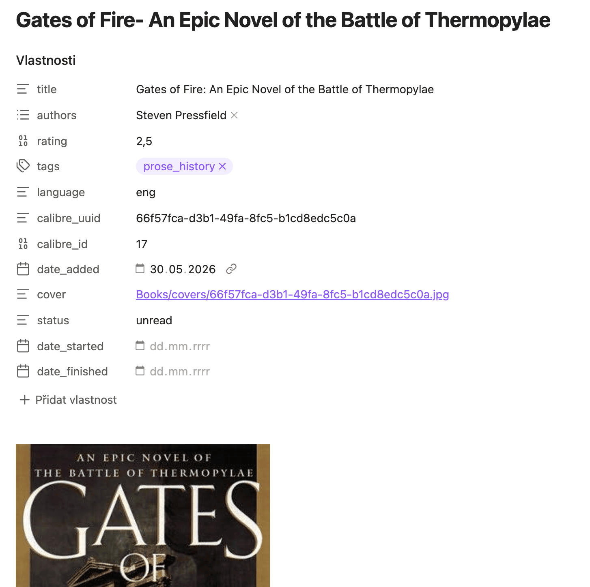
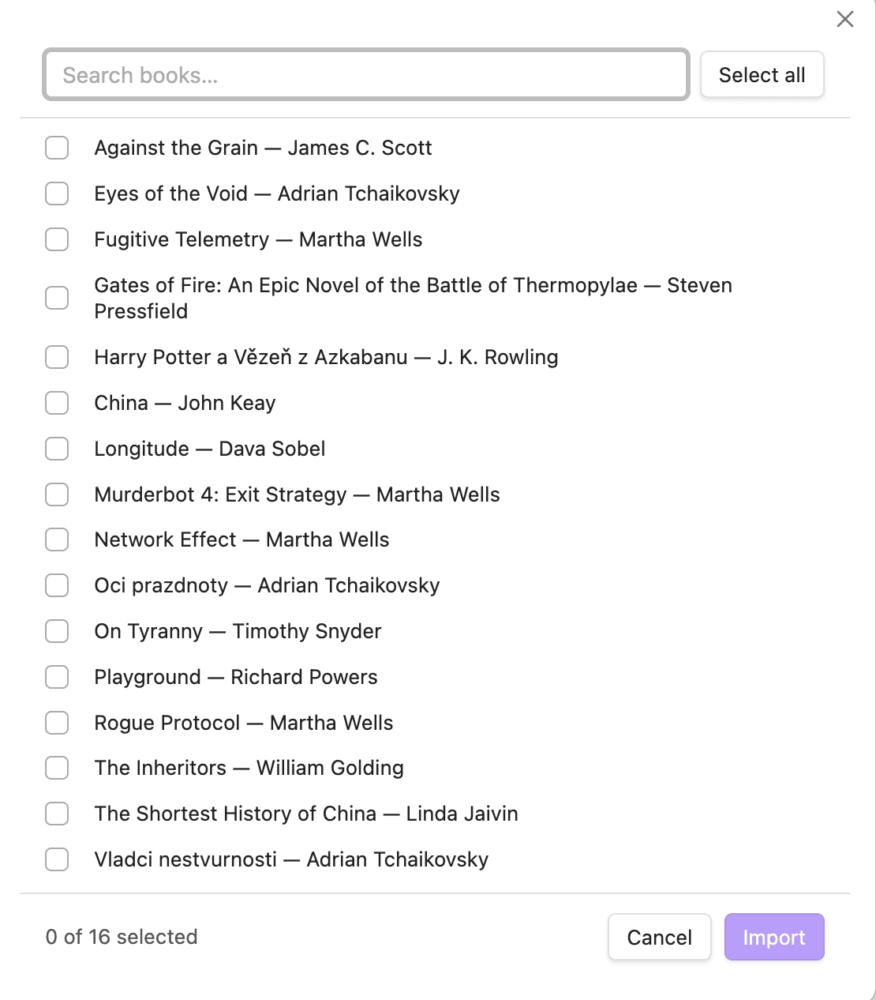
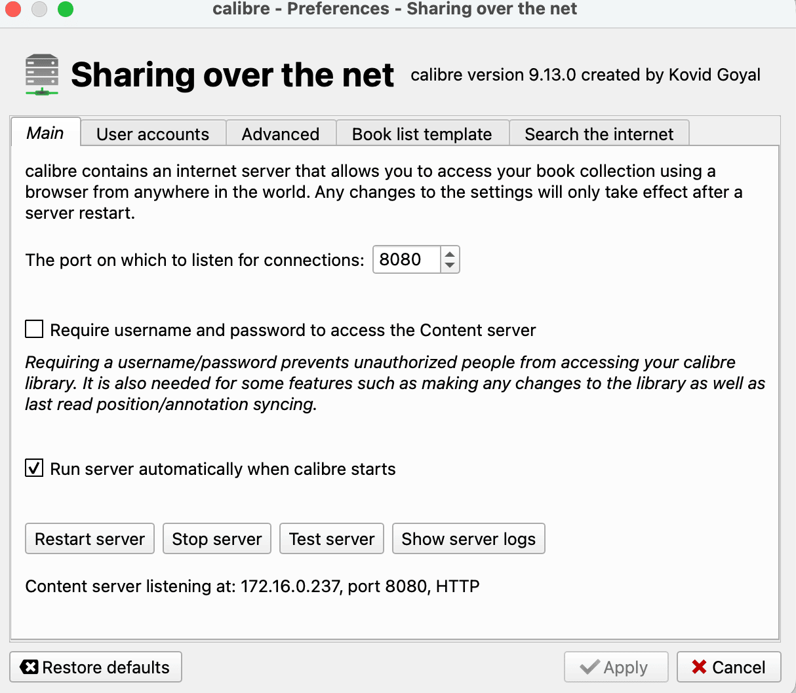

# Calibre Bridge

Bring your [Calibre](https://calibre-ebook.com) library into Obsidian — one structured note per book, with cover, metadata, description, and your Kobo highlights, kept in sync without ever touching the notes you write yourself.

## What you get

- **One note per book** — cover image, title, authors, series, rating, tags, publisher, ISBN, and more, all in frontmatter
- **Kobo highlights**, if you've fetched them into Calibre — quoted passages grouped by chapter, kept separate from the book description
- **Safe re-import** — re-running the import only refreshes Calibre-owned data; your `status`, `date_started`, `date_finished`, and anything you write below the managed section are never touched
- **Library overview** — a ready-made [Bases](https://help.obsidian.md/bases) view with Reading / Unread / Read / Did Not Finish tabs

## Getting started

1. In Calibre, open **Connect/share → Start Content Server**.

   

2. In Obsidian, open the plugin settings and point it at your server (`http://localhost:8080` if Calibre runs on the same machine). Click **Fetch libraries** to pick your library.

3. Run **Import books from Calibre** from the command palette, select the books you want, and they'll appear in your vault.

Run **Create library overview** any time to (re)generate the Bases file with pre-built views.

Run **Sync all imported books** to refresh every already-imported book from Calibre in one go — handy after fetching new highlights from your Kobo.

> **Note on tags:** The `tags` field is sourced from Calibre and overwritten on re-import. Use a separate field (e.g. `my_tags`) for your own tags.

## Installation

The recommended way to install Calibre Bridge is to search for it in the community plugin browser (**Settings → Community plugins → Browse**).

Pre-release versions can be installed via [BRAT](https://github.com/TfTHacker/obsidian42-brat) using `P24L/calibre-bridge`, or manually by copying `main.js`, `styles.css`, and `manifest.json` from the [latest release](../../releases/latest) into `.obsidian/plugins/calibre-bridge/`.

## Permissions and data access

The plugin connects only to the Calibre Content Server you configure — no external services are contacted. It also scans frontmatter in your book folder to detect already-imported notes; no files outside that folder are read or modified. If you use a Calibre password, credentials are stored in plaintext in the plugin's data file.

## License

MIT — see [LICENSE](LICENSE).
